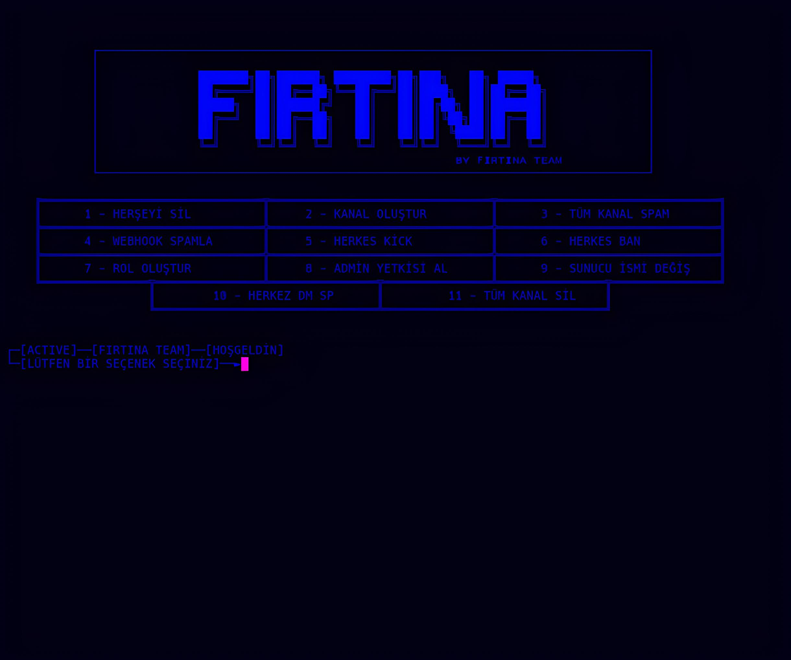
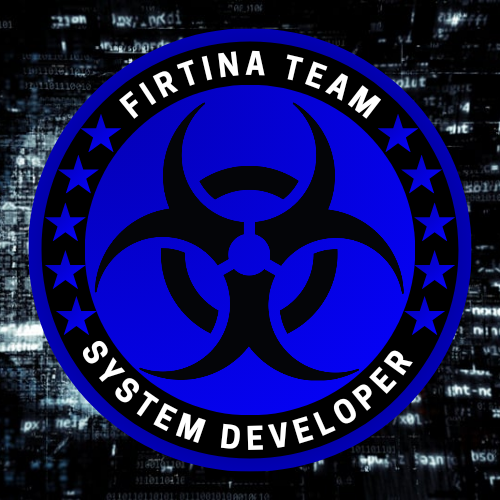

# FIRTINA TEAM SUNUCU PATLATMA TOOL



# discord.com/invite/firtinateam

# KURULUM

🔗 python
```bash
git clone https://github.com/firtinateam/discord-sunucu-patlatma
```

```bash
cd discord-sunucu-patlatma
```

 Python Modülleri İndirin
```bash
pip install -r requirements.txt
```

Kurulum Tamam şimdi çalıştırın
```bash
python main.py
```

# TOOL ÖZELİKLER
- Nuke: Sunucunun tüm kanallarını ve rollerini silin
- Kanal Oluştur: Özel adla metin/ses kanalları oluşturun
- Spam Kanalları: Botu kullanarak kanalları özel bir mesajla veya yerleştirmeyle doldurun.
- Webhook Spam: Kanalları özel bir mesaj veya yerleştirme ile webhook'larla doldurun (en hızlı)
- Tümünü Tekmele: Beyaz liste kimliği dışında sunucudaki herkesi tekmeleyin - Tümünü Yasakla: Beyaz liste kimliği dışında sunucudaki herkesi yasaklayın 
- Roller Oluştur: Özel bir adla roller oluşturun 
- Yönetici Alın: Bir kullanıcıya veya tüm sunucuya yönetici rolü verin 
- Sunucuyu Değiştir: Sunucuyu özel veya yapılandırılmış bir simge, ad ve açıklamayla değiştirin 
- Tümüne Dm : Tüm sunucu üyelerine özel mesaj gönderin 
-  Otomatik Baskın: Yapılandırılmış seçeneklerle Hızlı Baskın - Özel Bot Durumu: Yapılandırma dosyasındaki durum seçeneklerinizi ayarlayın
<br>

## 💊 Token Tools


<br>


**✨ VE DAHA FAZLASI<**

# ⚠ SORUMLULUK REDDİ
**Bu Aracı kullanmak Discord'un politika şartlarını ihlal etmek anlamına gelir ve bu Aracın sahibi hiçbir şeyden sorumlu değildir .**
